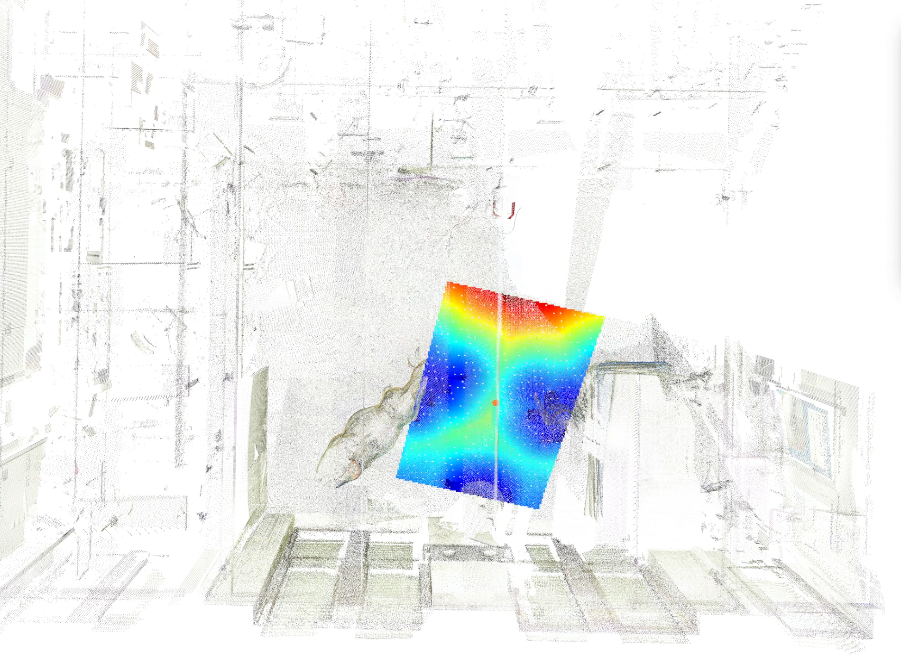
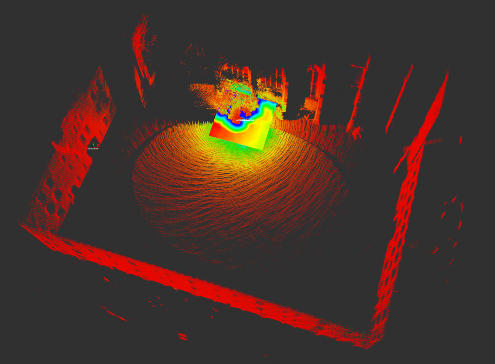

# erl_gp_sdf

[](https://github.com/ExistentialRobotics/erl_gp_sdf/tags)
[](https://opensource.org/licenses/MIT)
[](https://www.linux.org/)
[](https://www.apple.com/macos/)

[](http://wiki.ros.org/)
[](https://docs.ros.org/)
[](https://docs.ros.org/)

<p align="center">
  
  
</p>

**A C++ library for Gaussian Process regression on Signed Distance Fields.**

## Features

- **Gaussian Process Regression**: Implements Gaussian Process regression for SDFs.
- **Real-time Mapping**: Supports real-time mapping with SDFs.
- **Accurate SDF Prediction**: Provides accurate SDF predictions using Gaussian Processes.
- **C++ Implementation**: Written in C++ for performance and efficiency.
- **Python Bindings**: Includes Python bindings for easy integration with Python applications.
- **ROS Support**: Compatible with both ROS1 (Noetic) and ROS2 (Humble).
  🚪 [erl_gp_sdf_ros](https://github.com/ExistentialRobotics/erl_gp_sdf_ros)

## Getting Started

### Prerequisites

- C++17 compatible compiler
- CMake 3.24 or higher

### Create Workspace

```shell
mkdir -p <your_workspace>/src && \
vcs import --input https://raw.githubusercontent.com/ExistentialRobotics/erl_gp_sdf/refs/heads/main/erl_gp_sdf.repos <your_workspace>/src
```

### Dependencies

- [erl_cmake_tools](https://github.com/ExistentialRobotics/erl_cmake_tools)
- [erl_common](https://github.com/ExistentialRobotics/erl_common)
- [erl_covariance](https://github.com/ExistentialRobotics/erl_covariance)
- [erl_gaussian_process](https://github.com/ExistentialRobotics/erl_gaussian_process)
- [erl_geometry](https://github.com/ExistentialRobotics/erl_geometry)

```bash
# Ubuntu 20.04
wget -qO - https://raw.githubusercontent.com/ExistentialRobotics/erl_common/refs/heads/main/scripts/setup_ubuntu_20.04.bash | bash
wget -qO - https://raw.githubusercontent.com/ExistentialRobotics/erl_geometry/refs/heads/main/scripts/setup_ubuntu_20.04.bash | bash
# Ubuntu 22.04, 24.04
wget -qO - https://raw.githubusercontent.com/ExistentialRobotics/erl_common/refs/heads/main/scripts/setup_ubuntu_22.04_24.04.bash | bash
wget -qO - https://raw.githubusercontent.com/ExistentialRobotics/erl_geometry/refs/heads/main/scripts/setup_ubuntu_22.04_24.04.bash | bash
```

### Docker Option

The easiest way to get started is to use the
provided [Docker files](https://github.com/ExistentialRobotics/erl_geometry/tree/main/docker), which contains all
dependencies.

### Use as a standard CMake package

```bash
cd <your_workspace>
touch CMakeLists.txt
```

Add the following lines to your `CMakeLists.txt`:

```cmake
cmake_minimum_required(VERSION 3.16)
project(<your_project_name>)
add_subdirectory(src/erl_cmake_tools)
add_subdirectory(src/erl_common)
add_subdirectory(src/erl_covariance)
add_subdirectory(src/erl_geometry)
add_subdirectory(src/erl_gaussian_process)
add_subdirectory(src/erl_gp_sdf)
```

Then run the following commands:

```bash
mkdir -p build
cd build
cmake .. -DCMAKE_BUILD_TYPE=Release
make -j`nproc`
```

### Use as a ROS Package

```bash
cd <your_workspace>
source /opt/ros/<distro>/setup.bash
# for ROS1
catkin build erl_gp_sdf
source devel/setup.bash
# for ROS2
colcon build --packages-up-to erl_gp_sdf
source install/setup.bash
```

See also 🚪[erl_gp_sdf_ros](https://github.com/ExistentialRobotics/erl_gp_sdf_ros) for additional ROS tools.

### Install As Python Package

- Make sure you have installed all dependencies.
- Make sure you have the correct Python environment activated, `pipenv` is recommended.

```bash
cd <your_workspace>
for package in erl_cmake_tools erl_common erl_covariance erl_geometry erl_gaussian_process erl_gp_sdf; do
    cd src/$package
    pip install . --verbose
    cd ../..
done
```

## Usage

### Without ROS

#### C++

- [Gallery](test/gtest/README.md)
- [Surface mapping (Bayesian Hilbert Map) 2D](test/gtest/test_bayesian_hilbert_surface_mapping_2d.cpp) / [3D](test/gtest/test_bayesian_hilbert_surface_mapping_3d.cpp)
- [SDF mapping 2D](test/gtest/test_bayesian_hilbert_gp_sdf_mapping_2d.cpp)
- [SDF mapping 3D](test/gtest/test_bayesian_hilbert_gp_sdf_mapping_3d.cpp)

#### Python

- [Gallery](test/pytest/README.md)
- [SDF mapping 2D](test/pytest/test_gp_sdf_mapping_2d.py)
- [SDF mapping 3D](test/pytest/test_gp_sdf_mapping_3d.py)

### 🚪 [With ROS](https://github.com/ExistentialRobotics/erl_gp_sdf_ros)

### 🚪 [Configuration Guidance](docs/config_guidance.md)

## Acknowledgements

This work was supported by [ARL DCIST CRA](https://www.dcist-cra.org/) W911NF-17-2-0181, NSF FRR CAREER 2045945, the
Ministry of Trade, Industry, and Energy (MOTIE), Korea, under the Strategic Technology Development Program supervised by
the Korea Institute for Advancement of Technology (KIAT) [Grant No. P0026052], and the Korea Institute of Planning and
Evaluation for Technology in Food, Agriculture, Forestry (IPET) through the Smart Farm Innovation Technology Development
Program, funded by the Ministry of Agriculture, Food and Rural Affairs (MAFRA) (RS-2025-02219411).
