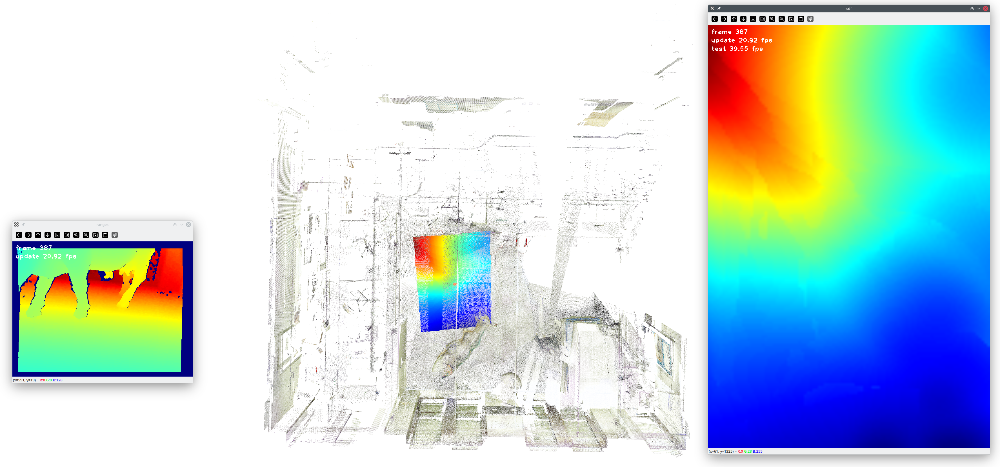

`erl_sdf_mapping`
=================



# Dependencies

- [erl_common](https://github.com/ExistentialRobotics/erl_common)
- [erl_covariance](https://github.com/ExistentialRobotics/erl_covariance)
- [erl_gaussian_process](https://github.com/ExistentialRobotics/erl_gaussian_process)
- [erl_geometry](https://github.com/ExistentialRobotics/erl_geometry)

# Installation

1. Create a source directory in your workspace
2. Clone the repositories into the source directory
    ```bash
    cd /path/to/your/workspace/src
    for repo in erl_common erl_covariance erl_gaussian_process erl_geometry erl_sdf_mapping; do
        git clone --recursive https://github.com/ExistentialRobotics/${repo}.git
    done
    ```
3. Create a top-level CMakeLists.txt in your workspace
    ```cmake
    cmake_minimum_required(VERSION 3.24)
    project(your_project_name)
   
    add_subdirectory(src/erl_common)
    add_subdirectory(src/erl_covariance)
    add_subdirectory(src/erl_geometry)
    add_subdirectory(src/erl_gaussian_process)
    add_subdirectory(src/erl_sdf_mapping)
    ```
4. Build your workspace (Without ROS)
    ```bash
    cd /path/to/your/workspace
    mkdir build && cd build
    cmake .. -DCMAKE_BUILD_TYPE=Release
    make -j`nproc`
    ```
5. Or build your workspace (With ROS Noetic)
    ```bash
    source /opt/ros/noetic/setup.bash
    cd /path/to/your/workspace
    catkin build --verbose
    ```

# Build With Docker

```bash
cd /path/to/erl_common
cd docker
./build.bash

cd /path/to/erl_geometry
cd docker
./build.bash
# If you want to use ROS1, run the following command instead
# BUILD_ROS_NOETIC=true ./build.bash
```

# Usage

## C++

- [Gallery](test/gtest/README.md)
- [Gaussian Process based surface mapping 2D / 3D](test/gtest/test_gp_occ_surface_mapping.cpp)
- [Gaussian Process based SDF mapping 2D](test/gtest/test_gp_sdf_mapping_2d.cpp)
- [Gaussian Process based SDF mapping 3D](test/gtest/test_gp_sdf_mapping_3d.cpp)

## Python

- [Gallery](test/pytest/README.md)
- [Gaussian Process based SDF mapping 3D](test/pytest/test_gp_sdf_mapping_3d.py)

# Pretrained GP-SDF Models

- [3D GP-SDF Model](https://drive.google.com/file/d/1K69JHQLg7LuNNc5ZhkY8-frIqXQisSpP/view?usp=sharing)
  trained on [Cow And Lady](https://projects.asl.ethz.ch/datasets/doku.php?id=iros2017), which can
  be loaded using the implementation
  from [erl_geometry](https://github.com/ExistentialRobotics/erl_geometry/blob/main/include/erl_geometry/cow_and_lady.hpp).
- [3D GP-SDF Model](https://drive.google.com/file/d/1fraha9Fm00-3uKDujFBdsTSOJ4ZXsjdp/view?usp=sharing)
  trained on [Replica Hotel](data/replica-hotel-0.ply) with 640x480 simulated depth camera.
- [3D GP-SDF Model](https://drive.google.com/file/d/106SZjY4xzPJWYWYkD4LjINdxmUadlABV/view?usp=sharing)
  trained on [Replica Hotel](data/replica-hotel-0.ply) with simulated 3D
  LiDAR ([Velodyne Puck](https://www.amtechs.co.jp/product/VLP-16-Puck.pdf)).
- [3D GP-SDF Model](https://drive.google.com/file/d/135hlITMUeMNLi42VgdIteQmb2YK2m1y5/view?usp=sharing)
  trained on [Replica Hotel](data/replica-hotel-0.ply) with simulated 3D 360 LiDAR.
- [2D GP-SDF Model](https://drive.google.com/file/d/1ET0JUxA8fpUzYNkZXLheApPk3vqrPdiL/view?usp=sharing)
  trained on [UCSD-FAH-2D](data/ucsd_fah_2d.dat).
- [2D GP-SDF Model](https://drive.google.com/file/d/1JEZcFxGaI2ctoL_tiyqtAK-ARvFpHsFg/view?usp=sharing)
  trained on [Gazebo Room 2D](data/gazebo_train.dat) with simulated 2D LiDAR.
- [2D GP-SDF Model](https://drive.google.com/file/d/1hwmpCe2c8NZ6K9RAcrWyFfP1RMW9dr9l/view?usp=sharing)
  trained on [House Expo LiDAR 2D](data/house_expo_room_1451.json) with simulated 2D LiDAR.
