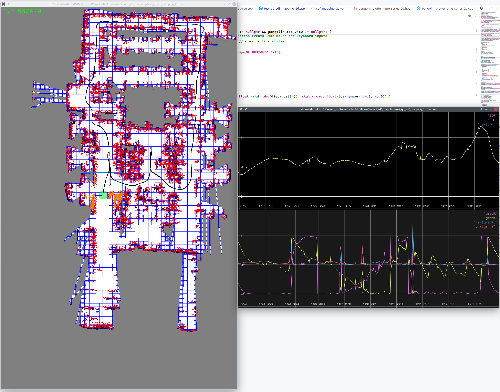
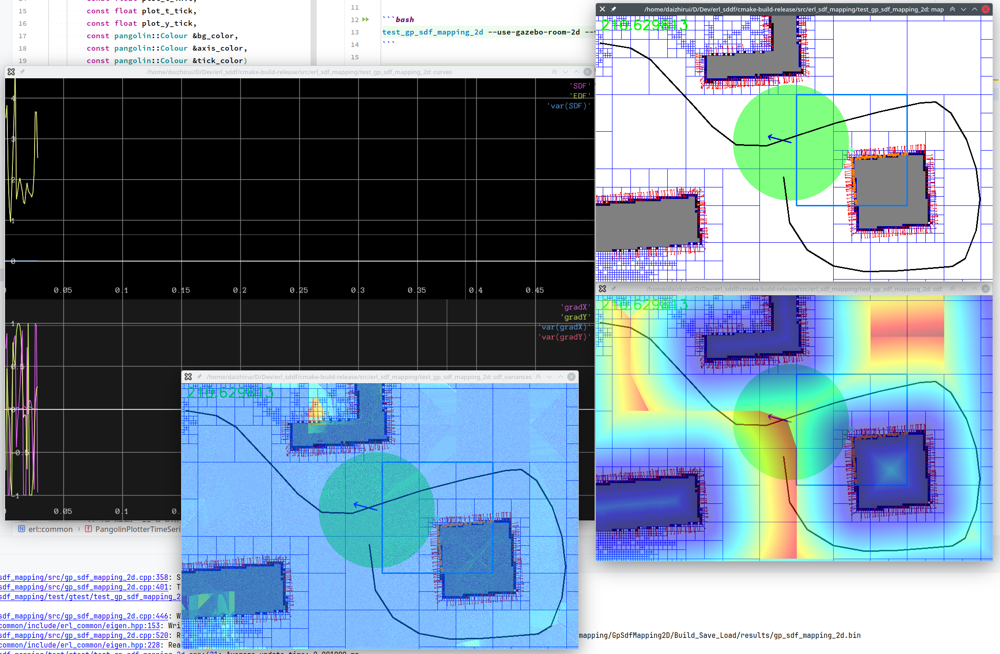
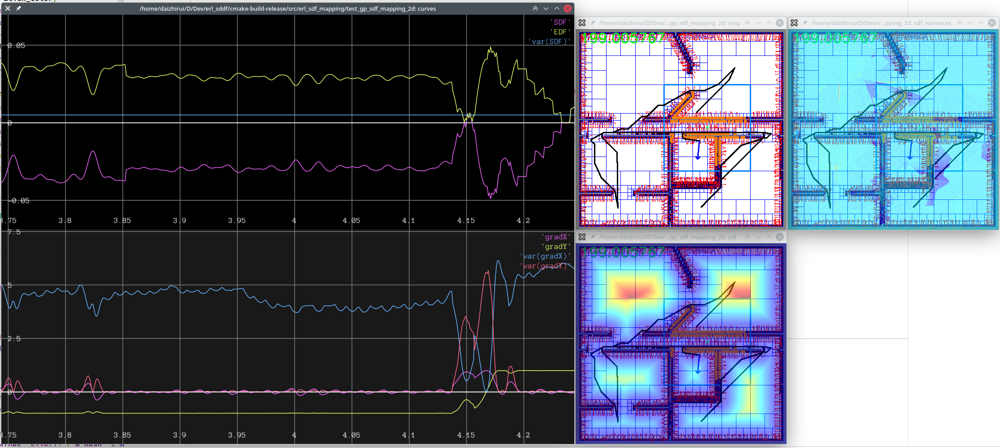
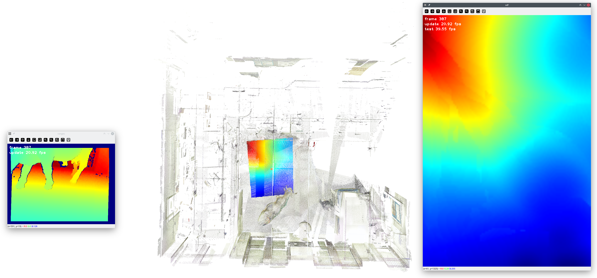
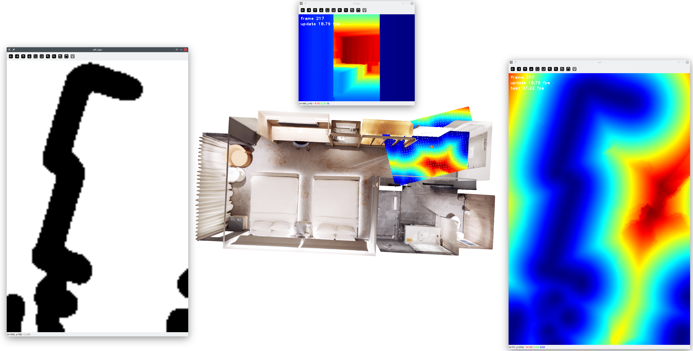
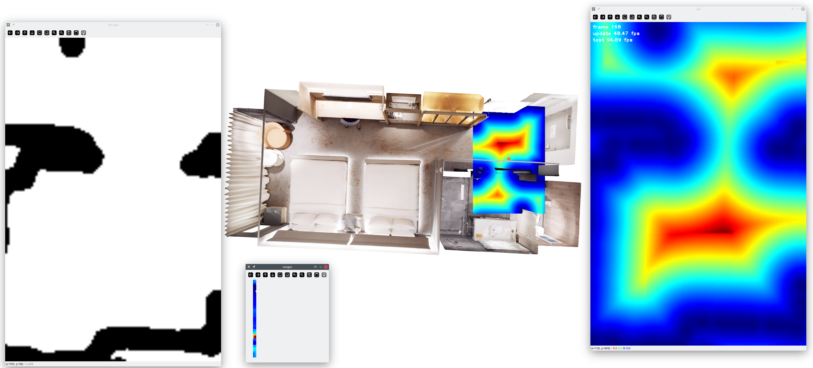

GTest for SDF Mapping
======================

# UCSD Franklin Antonio Hall + 2D LiDAR

```bash
test_gp_sdf_mapping_2d --use-ucsd-fah-2d --visualize
```


[Video](https://drive.google.com/file/d/1bl9to0n-DkBYx3LNK6IWIrLBDTE_2l2z/view?usp=sharing) is
generated
with `--save-video` option.

[SDF Checkpoint](https://drive.google.com/file/d/1ET0JUxA8fpUzYNkZXLheApPk3vqrPdiL/view?usp=sharing)
is saved
with `--test-io` option.

# Gazebo Room 2D

```bash
export CONFIG_DIR=<erl_gp_sdf_repo>/config>
test_gp_sdf_mapping_2d --use-gazebo-room-2d --visualize --hold \
  --surface-mapping-config-file ${CONFIG_DIR}/gp_occ_mapping_gazebo_2d_float.yaml \
  --sdf-mapping-config-file ${CONFIG_DIR}/sdf_mapping_gazebo_2d_float.yaml \
  --interactive --gtest_filter=GpSdfMapping.2Df
```


[SDF Checkpoint](https://drive.google.com/file/d/1JEZcFxGaI2ctoL_tiyqtAK-ARvFpHsFg/view?usp=sharing)
is provided.

# House Expo LiDAR 2D

```bash
test_gp_sdf_mapping_2d --use-house-expo-lidar-2d
```


[SDF Checkpoint](https://drive.google.com/file/d/1hwmpCe2c8NZ6K9RAcrWyFfP1RMW9dr9l/view?usp=sharing)
is provided.

# Cow And Lady

```bash
test_gp_sdf_mapping_3d --gtest_filter=GpSdfMapping3D.Build_Save_Load \
  --sdf-mapping-config-file <erl_gp_sdf_repo>/config/sdf_mapping_3d_depth.yaml \
  --use-cow-and-lady \
  --cow-and-lady-dir <cow_and_lady_dir>
```



- `<cow_and_lady_dir>` should contains `pcd` and `color` folders, which can be generated by
  using `<erl_geometry_repo>/scripts/rosbag_extract_cow_and_lady.py` with the original `data.bag`
  file
  from [Cow And Lady](https://projects.asl.ethz.ch/datasets/doku.php?id=iros2017).

# Replica Hotel + Depth Camera

```bash
test_gp_sdf_mapping_3d --gtest_filter=GpSdfMapping3D.Build_Save_Load \
    --sdf-mapping-config-file <erl_gp_sdf_repo>/config/sdf_mapping_3d_depth.yaml
```



[SDF Checkpoint](https://drive.google.com/file/d/1fraha9Fm00-3uKDujFBdsTSOJ4ZXsjdp/view?usp=sharing)
is provided.

# Replica Hotel + 3D LiDAR

```bash
export CONFIG_DIR=<erl_gp_sdf_repo>/config
test_gp_sdf_mapping_3d \
  --surface-mapping-config-file ${CONFIG_DIR}/gp_occ_mapping_replica_3d_lidar_360_float.yaml \
  --sdf-mapping-config-file ${CONFIG_DIR}/sdf_mapping_replica_lidar_360_float.yaml \
  --test-whole-map-at-end --hold --test-z 0.0 --gtest_filter=GpSdfMapping.3Df
```



[SDF Checkpoint](https://drive.google.com/file/d/106SZjY4xzPJWYWYkD4LjINdxmUadlABV/view?usp=sharing)
is provided.

360 LiDAR is also tested with the corresponding
config [file](../../config/sdf_mapping_3d_lidar_360.yaml). And the
SDF Checkpoint
is [here](https://drive.google.com/file/d/135hlITMUeMNLi42VgdIteQmb2YK2m1y5/view?usp=sharing).
