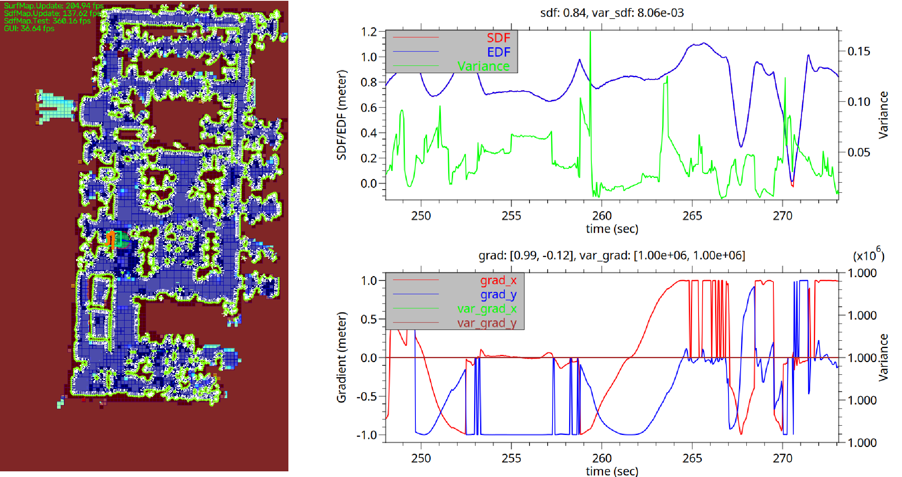
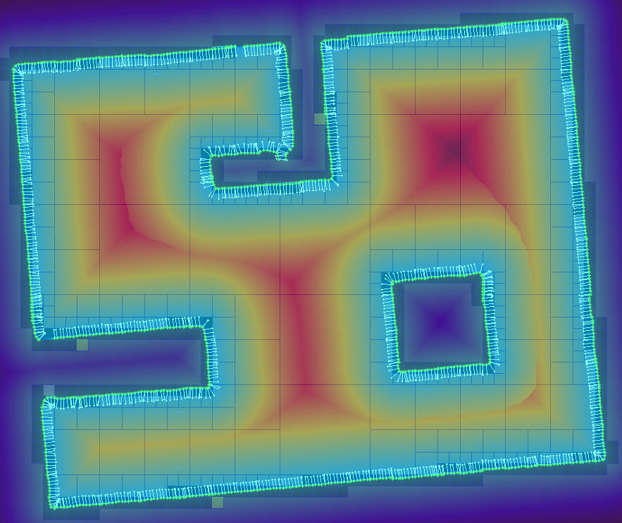
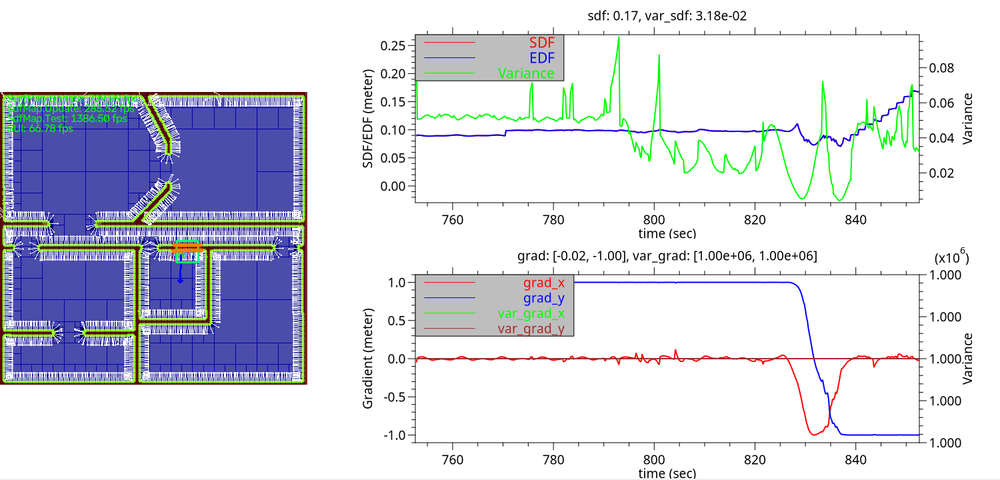
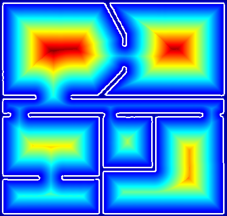
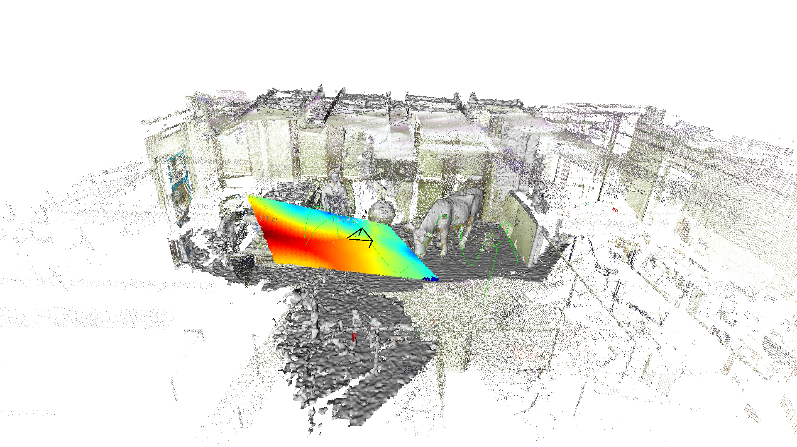
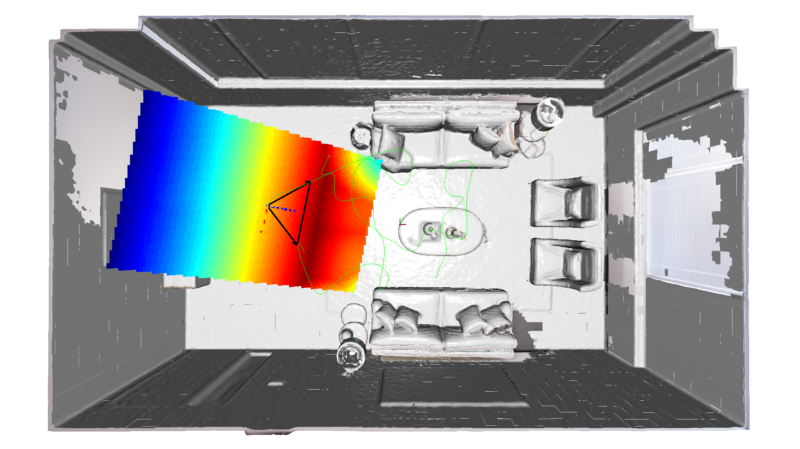
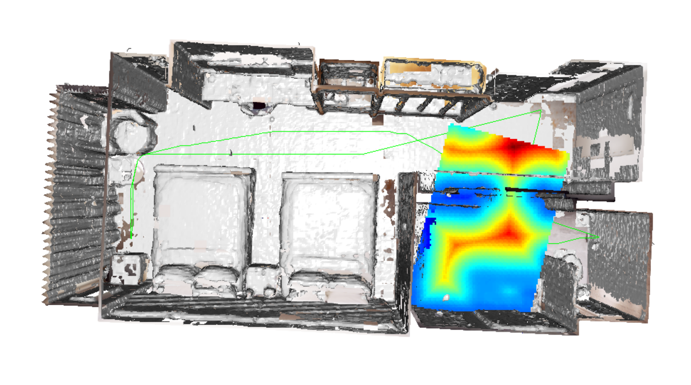
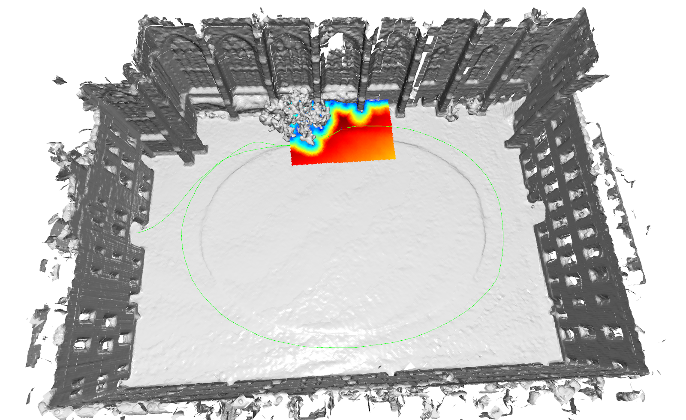

GTest for SDF Mapping
======================

The commands below assume the executables are on your `PATH` (they are built under
`<build_dir>/src/erl_gp_sdf`) and that `<erl_gp_sdf_repo>` points to this package. Dataset files for
the 2D examples ship in [`data/`](../../data); the 3D examples require external datasets.

# UCSD Franklin Antonio Hall + 2D LiDAR

```bash
# extract the packaged dataset once: tar -xzf <erl_gp_sdf_repo>/data/ucsd_fah_2d.dat.tar.gz -C <erl_gp_sdf_repo>/data
export CONFIG_DIR=<erl_gp_sdf_repo>/config/ucsd_fah_2d
test_bayesian_hilbert_gp_sdf_mapping_2d --gtest_filter=GpSdfMapping.BayesianHilbert2Df \
    --dataset_type ucsd_fah_2d \
    --ucsd_fah_2d_file <erl_gp_sdf_repo>/data/ucsd_fah_2d.dat \
    --surf_map_config_file ${CONFIG_DIR}/bayesian_hilbert/surf_mapping_float_scale0.1.yaml \
    --sdf_map_config_file ${CONFIG_DIR}/bayesian_hilbert/sdf_mapping_float.yaml \
    --visualize true \
    --output_dir <output_dir>
```

<p align="center"></p>

# Gazebo Room 2D

```bash
export CONFIG_DIR=<erl_gp_sdf_repo>/config/gazebo
test_bayesian_hilbert_gp_sdf_mapping_2d --gtest_filter=GpSdfMapping.BayesianHilbert2Df \
    --dataset_type gazebo_room_2d \
    --gazebo_dir <erl_gp_sdf_repo>/data/gazebo \
    --surf_map_config_file ${CONFIG_DIR}/bayesian_hilbert/surf_mapping_float.yaml \
    --sdf_map_config_file ${CONFIG_DIR}/bayesian_hilbert/sdf_mapping_float.yaml \
    --visualize true --interactive true \
    --output_dir <output_dir>
```

<p align="center"></p>

# House Expo LiDAR 2D

```bash
export CONFIG_DIR=<erl_gp_sdf_repo>/config/house_expo_2d
test_bayesian_hilbert_gp_sdf_mapping_2d --gtest_filter=GpSdfMapping.BayesianHilbert2Df \
    --dataset_type house_expo_lidar_2d \
    --surf_map_config_file ${CONFIG_DIR}/bayesian_hilbert/surf_mapping_float.yaml \
    --sdf_map_config_file ${CONFIG_DIR}/bayesian_hilbert/sdf_mapping_float.yaml \
    --visualize true \
    --output_dir <output_dir>
```

<p align="center"></p>
<p align="center"></p>

# Cow And Lady

```bash
export CONFIG_DIR=<erl_gp_sdf_repo>/config/cow_and_lady
test_bayesian_hilbert_gp_sdf_mapping_3d --gtest_filter=GpSdfMapping.BayesianHilbert3Df \
    --dataset_type cow_and_lady \
    --cow_and_lady_dir <cow_and_lady_dir> \
    --surf_map_config_file ${CONFIG_DIR}/bayesian_hilbert/surf_mapping_float.yaml \
    --sdf_map_config_file ${CONFIG_DIR}/bayesian_hilbert/sdf_mapping_float.yaml \
    --o3d_view_status_file ${CONFIG_DIR}/open3d_view_status3.json \
    --output_dir <output_dir>
```

<p align="center"></p>

- `<cow_and_lady_dir>` should contain `pcd` and `color` folders, which can be generated by
    using `<erl_geometry_repo>/scripts/rosbag_extract_cow_and_lady.py` with the original `data.bag`
    file
    from [Cow And Lady](https://projects.asl.ethz.ch/datasets/voxblox/).

# Replica room0 (RGBD)

Uses the [Replica](https://github.com/facebookresearch/Replica-Dataset) RGB-D sequences (external
download). `<replica_rgbd_dir>` should contain the scene subfolder (e.g. `room0`).

```bash
export CONFIG_DIR=<erl_gp_sdf_repo>/config/replica
test_bayesian_hilbert_gp_sdf_mapping_3d --gtest_filter=GpSdfMapping.BayesianHilbert3Df \
    --dataset_type replica_rgbd \
    --replica_rgbd_dir <replica_rgbd_dir> \
    --replica_rgbd_scene_name room0 \
    --surf_map_config_file ${CONFIG_DIR}/bayesian_hilbert/surf_mapping_rgbd_float.yaml \
    --sdf_map_config_file ${CONFIG_DIR}/bayesian_hilbert/sdf_mapping_rgbd_float.yaml \
    --o3d_view_status_file ${CONFIG_DIR}/open3d_view_status/room0.json \
    --output_dir <output_dir>
```

<p align="center"></p>

# Replica Hotel (simulated 3D LiDAR)

No external dataset needed — this simulates a 360° LiDAR sweeping the packaged `replica-hotel-0.ply`
mesh along a trajectory.

```bash
# extract the packaged mesh once: tar -xzf <erl_gp_sdf_repo>/data/replica-hotel-0.ply.tar.gz -C <erl_gp_sdf_repo>/data
export CONFIG_DIR=<erl_gp_sdf_repo>/config/replica
test_bayesian_hilbert_gp_sdf_mapping_3d --gtest_filter=GpSdfMapping.BayesianHilbert3Df \
    --dataset_type mesh \
    --mesh_file <erl_gp_sdf_repo>/data/replica-hotel-0.ply \
    --traj_file <erl_gp_sdf_repo>/data/replica-hotel-0-traj.txt \
    --surf_map_config_file ${CONFIG_DIR}/bayesian_hilbert/surf_mapping_lidar_360_float.yaml \
    --sdf_map_config_file ${CONFIG_DIR}/bayesian_hilbert/sdf_mapping_lidar_360_float.yaml \
    --o3d_view_status_file ${CONFIG_DIR}/open3d_view_status/hotel0.json \
    --output_dir <output_dir>
```

<p align="center"></p>

# Newer College

## Bayesian Hilbert Surface Mapping

```bash
export CONFIG_DIR=<erl_gp_sdf_repo>/config/newer_college
test_bayesian_hilbert_surface_mapping_3d --gtest_filter=SurfMapping.BayesianHilbert3Df \
    --dataset_type newer_college \
    --newer_college_dir <newer_college_dir> \
    --surf_map_config_file ${CONFIG_DIR}/bayesian_hilbert/surf_mapping_float_scale0.1.yaml \
    --o3d_view_status_file ${CONFIG_DIR}/open3d_view_status.json \
    --output_dir <output_dir>
```

## GpSdfMapping with Bayesian Hilbert Surface Mapping

```bash
export CONFIG_DIR=<erl_gp_sdf_repo>/config/newer_college
test_bayesian_hilbert_gp_sdf_mapping_3d --gtest_filter=GpSdfMapping.BayesianHilbert3Df \
    --dataset_type newer_college \
    --newer_college_dir <newer_college_dir> \
    --surf_map_config_file ${CONFIG_DIR}/bayesian_hilbert/surf_mapping_float_scale0.1.yaml \
    --sdf_map_config_file ${CONFIG_DIR}/bayesian_hilbert/sdf_mapping_float.yaml \
    --o3d_view_status_file ${CONFIG_DIR}/open3d_view_status.json \
    --test_res_whole_map 0.1 \
    --test_res_follow_map 0.1 \
    --show_geometries "all,-pcd_obs,-pcd_surf_points,-line_set_surf_normals,-line_set_clusters,-gt_scene" \
    --output_dir <output_dir>
```

<p align="center"></p>