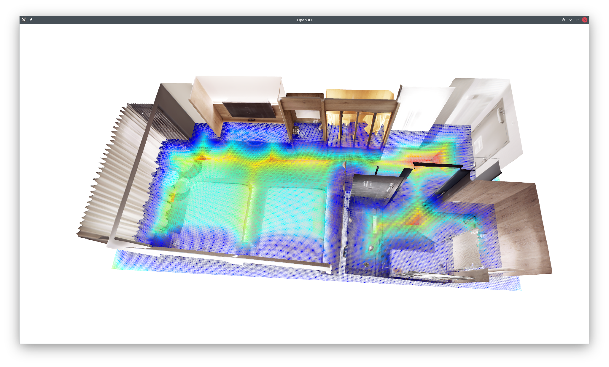

PyTest for SDF Mapping
======================

# Load SDF Mapping 3D from Checkpoint

```bash
python test_gp_sdf_mapping_3d.py \
  --sdf-mapping-config-file ../../config/sdf_mapping_3d_lidar.yaml \
  --sdf-mapping-bin-file <path_to_sdf_mapping_replica_lidar.bin> \
  --mesh ../../data/replica-hotel-0.ply
```


